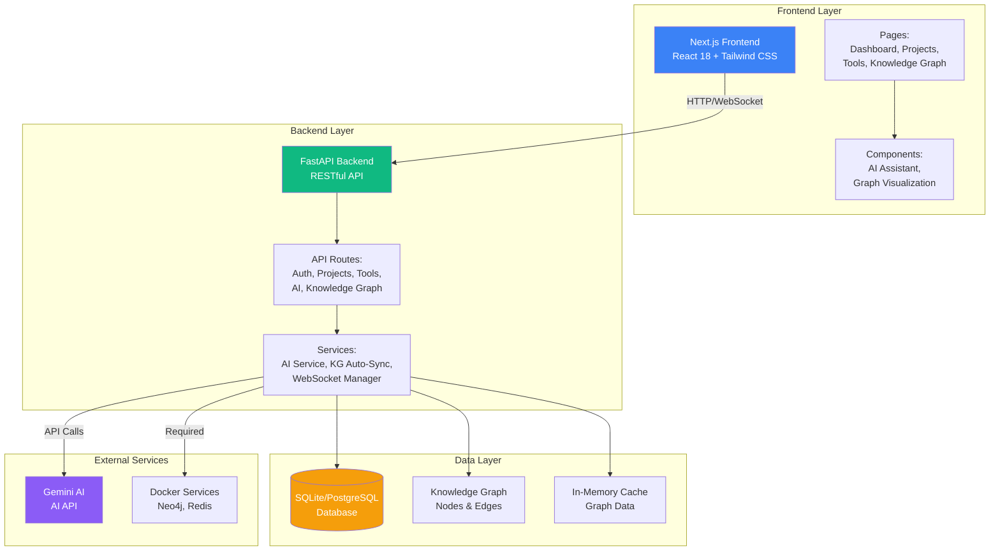
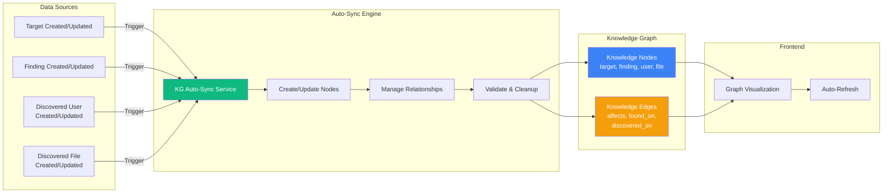
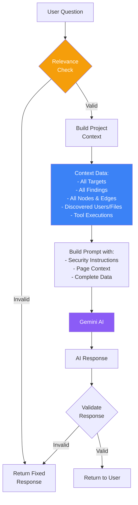
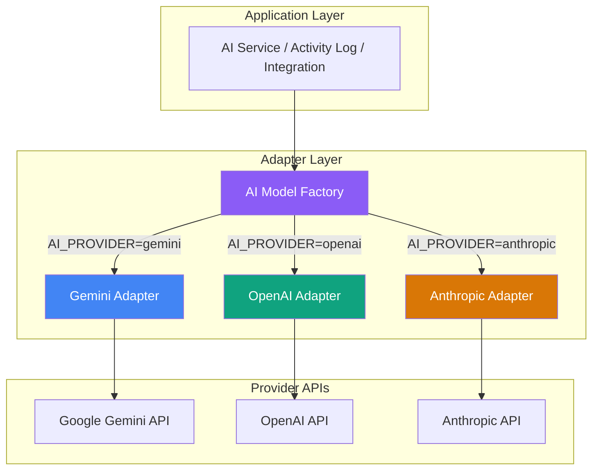
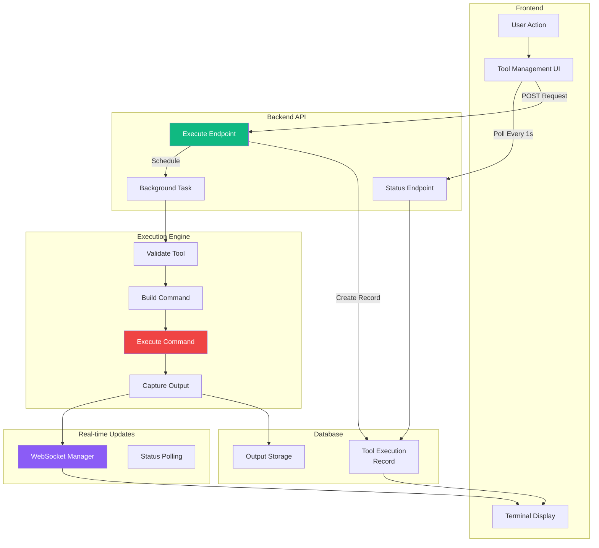
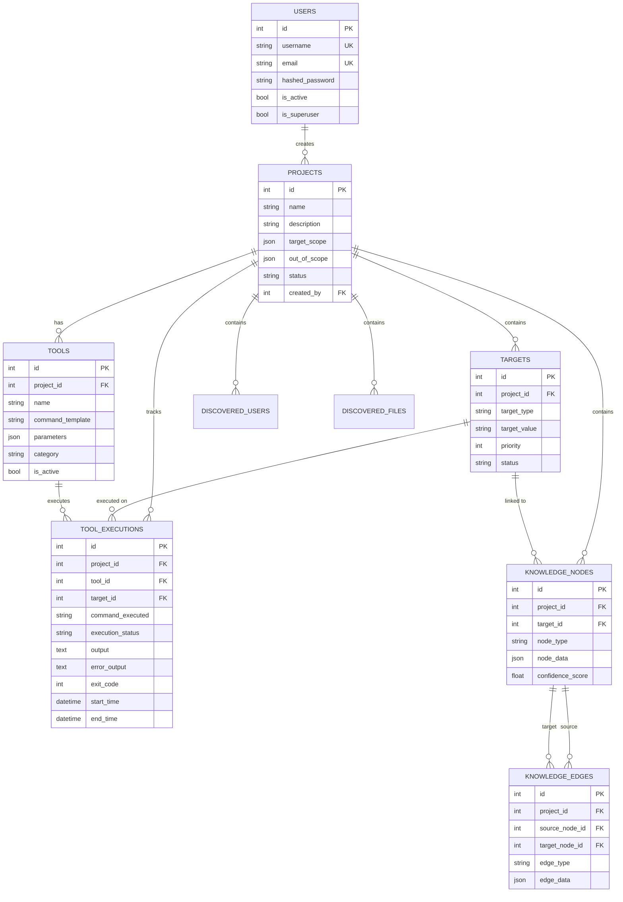
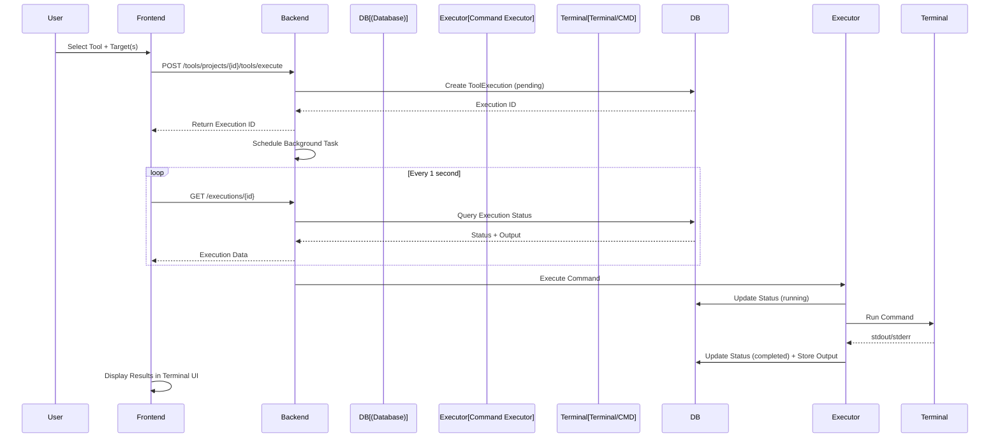
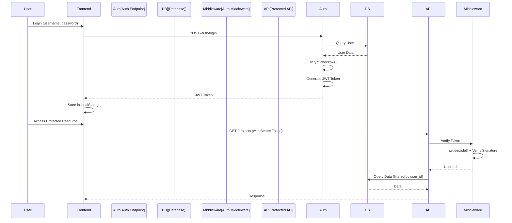

# BountyFlow Technical Architecture

Complete technical architecture documentation for BountyFlow platform.

## Table of Contents

- [System Architecture Overview](#system-architecture-overview)
- [Knowledge Graph Auto-Sync Architecture](#knowledge-graph-auto-sync-architecture)
- [AI Assistant Integration Flow](#ai-assistant-integration-flow)
- [Tool Execution Architecture](#tool-execution-architecture)
- [Data Model Relationships](#data-model-relationships)
- [Backend Architecture](#backend-architecture)
- [Frontend Architecture](#frontend-architecture)
- [Data Flow Architecture](#data-flow-architecture)
- [Security Architecture](#security-architecture)
- [API Reference](#api-reference)

## System Architecture Overview



## Knowledge Graph Auto-Sync Architecture



## AI Assistant Integration Flow



## Multi-Model AI Architecture

BountyFlow supports multiple AI providers through an Adapter Pattern design, allowing seamless switching between different models.



### Adapter Pattern Implementation

Each AI adapter implements the same interface:

```python
class AIModelAdapter(ABC):
    @abstractmethod
    async def analyze_activity(self, tool_name, command, output, target) -> AnalysisResult
    
    @abstractmethod
    async def normalize_format(self, raw_data, format_hint) -> NormalizedData
    
    @abstractmethod
    async def extract_entities(self, text, context) -> List[Dict]
    
    @abstractmethod
    def is_available(self) -> bool
```

### Supported Providers

| Provider | Adapter Class | Environment Variables |
|----------|---------------|----------------------|
| Google Gemini | `GeminiAdapter` | `GEMINI_API_KEY`, `GEMINI_MODEL` |
| OpenAI | `OpenAIAdapter` | `OPENAI_API_KEY`, `OPENAI_MODEL` |
| Anthropic Claude | `AnthropicAdapter` | `ANTHROPIC_API_KEY`, `ANTHROPIC_MODEL` |

### Configuration

Select the AI provider via `AI_PROVIDER` environment variable:

```bash
# .env file
AI_PROVIDER=gemini  # Options: gemini, openai, anthropic

# Provider-specific settings
GEMINI_API_KEY=your_key
GEMINI_MODEL=gemini-2.0-flash

OPENAI_API_KEY=your_key
OPENAI_MODEL=gpt-4

ANTHROPIC_API_KEY=your_key
ANTHROPIC_MODEL=claude-3-opus-20240229
```

### Unified Response Format

All adapters return standardized `AnalysisResult` objects:

```python
@dataclass
class AnalysisResult:
    summary: str                    # Human-readable analysis
    attack_phase: Optional[str]     # reconnaissance, exploitation, etc.
    mitre_techniques: List[str]     # MITRE ATT&CK IDs
    tags: List[str]                 # Relevant tags
    confidence: float               # 0.0 to 1.0
    raw_response: Optional[Dict]    # Original API response
```

## Tool Execution Architecture



## Data Model Relationships



## Backend Architecture

### FastAPI Framework

- **Async/Await**: All database operations use async SQLAlchemy for non-blocking I/O
- **Automatic API Documentation**: Swagger UI at `/docs`, ReDoc at `/redoc`
- **Type Safety**: Pydantic schemas for request/response validation
- **Dependency Injection**: Clean separation of concerns with FastAPI dependencies
- **Background Tasks**: Long-running operations (tool execution) run asynchronously

### Database Layer

- **SQLAlchemy ORM**: Async database operations with connection pooling
- **SQLite (Default)**: Local file-based database at `apps/backend/bountyflow.db` (fixed location)
- **PostgreSQL Support**: Can be configured via `DATABASE_URL` environment variable
- **Automatic Schema Creation**: Tables auto-created on first startup via `Base.metadata.create_all()`
- **Data Isolation**: Each developer has independent local database (never committed to Git)
- **Connection Pooling**: Pre-warmed pool on startup for faster queries
- **Transaction Management**: Automatic commit/rollback with dependency injection

### Authentication & Security

**JWT Token System:**

- **Automatic SECRET_KEY Generation**: 32-byte (256-bit) random key auto-generated on first startup
- **Storage**: SECRET_KEY saved to `apps/backend/.env` file (excluded from Git)
- **Algorithm**: HS256 (HMAC-SHA256)
- **Expiration**: 30 minutes (configurable via `ACCESS_TOKEN_EXPIRE_MINUTES`)
- **Token Payload**: Contains `username`, `user_id`, `is_superuser` claims
- **Bearer Authentication**: Tokens sent via `Authorization: Bearer <token>` header

**Password Security:**

- **bcrypt Hashing**: All passwords hashed with bcrypt before storage
- **Salt Generation**: Unique salt per password (`bcrypt.gensalt()`)
- **Verification**: Login uses `bcrypt.checkpw()` - never compares plaintext
- **Default Users**: `admin` and `test_user` passwords hashed on creation
- **User Registration**: New user passwords automatically hashed

**Security Features:**

- **Token-Based Auth**: Stateless JWT authentication
- **Optional Authentication**: Some endpoints use `get_current_user_optional` for anonymous access
- **CORS Protection**: Properly configured (no wildcard with credentials)
- **SQL Injection Prevention**: SQLAlchemy ORM prevents SQL injection
- **Input Validation**: Pydantic schemas validate all API inputs

### Tool Execution System

**Execution Flow:**

1. **Request Processing**: Frontend sends tool execution request with target(s)
2. **Record Creation**: Backend creates `ToolExecution` record with status "pending"
3. **Background Task**: FastAPI `BackgroundTasks` schedules execution
4. **Command Execution**:
   - **Windows**: Uses `cmd.exe` with `asyncio.create_subprocess_shell`
   - **Linux/Mac**: Uses `/bin/sh` with async subprocess
5. **Output Capture**: stdout/stderr captured and stored in database
6. **Status Updates**: Status transitions: `pending` → `running` → `completed`/`failed`
7. **Real-Time Polling**: Frontend polls `/api/v1/tools/executions/{execution_id}` every 1 second

**Multi-Target Support:**

- Tool can specify multiple targets via `parameters.selected_targets`
- Command template uses `{target}` placeholder
- System automatically executes command for each target sequentially
- Each execution creates separate `ToolExecution` record

### Knowledge Graph Auto-Sync

**Synchronization Triggers:**

- File updates: When `target_id` or other properties change
- Target creation/updates: New relationships automatically created
- Finding creation: Linked to targets and files
- User discovery: Connected to targets and files

**Implementation:**

- `kg_auto_sync.py` service handles all sync operations
- Called from API endpoints after database commits
- Updates `knowledge_nodes` and `knowledge_edges` tables
- Removes old relationships before creating new ones
- Ensures data consistency

### API Design Patterns

**RESTful Structure:**

- `/api/v1/projects` - Project management
- `/api/v1/projects/{id}/tools` - Project-specific tools
- `/api/v1/tools` - Global tool management
- `/api/v1/tools/projects/{id}/tools/execute` - Tool execution
- `/api/v1/tools/executions/{id}` - Execution results
- `/api/v1/admin/dashboard/*` - Dashboard statistics

**Error Handling:**

- Standardized JSON error responses
- CORS headers included in error responses
- Detailed error messages for debugging
- Graceful degradation for optional operations

**Response Models:**

- Pydantic schemas ensure type safety
- Consistent response format across endpoints
- Optional fields handled properly (`Optional[datetime]` with defaults)

## Frontend Architecture

### Next.js Framework

- **Server-Side Rendering (SSR)**: Optimized initial page load
- **Client-Side Routing**: Fast navigation with Next.js Router
- **Dynamic Imports**: Heavy components (charts, graphs) loaded lazily
- **API Routes**: Proxy endpoints for backend communication (if needed)

### State Management

**React Hooks:**

- `useState`: Component-level state (tool lists, project data, UI state)
- `useEffect`: Side effects (data fetching, event listeners, cleanup)
- `useRef`: Persistent references (prevent closure issues in event handlers)
- `useRouter`: Navigation and route management

**Persistent Storage:**

- **localStorage**:
  - JWT tokens (`token`)
  - User information (`user`)
  - UI preferences (sidebar collapsed state)
  - Tool list update flags (`toolListUpdated`)

**Cross-Component Communication:**

- **Custom Events**: `toolCreated`, `toolUpdated`, `toolDeleted`, `projectDataUpdated`
- **Storage Events**: Cross-tab synchronization via `storage` event listener
- **Visibility API**: Auto-refresh when tab becomes active (`visibilitychange`)

### Authentication Flow

**Login Process:**

1. User submits credentials via `/api/v1/auth/login`
2. Backend verifies password and returns JWT token
3. Frontend stores token in `localStorage`
4. Token included in all subsequent API requests

**Protected Routes:**

- Client-side check: `useEffect` checks for token in `localStorage`
- Redirect: If no token, redirect to `/login?redirect=/dashboard`
- Token Validation: Backend middleware verifies token on each request

**Token Management:**

- Automatic inclusion in fetch headers
- Optional authentication support (dashboard endpoints)
- Token expiration handled gracefully

### Real-Time Updates

**Polling Strategy:**

- Tool execution status: 1-second intervals for up to 2 minutes
- Dashboard data: 30-second refresh intervals
- Graph updates: Event-driven + visibility change detection

**Event-Driven Updates:**

- Tool creation/update triggers `CustomEvent` dispatch
- Other tabs/instances listen via `storage` event
- Components refresh automatically when events fire

## Data Flow Architecture

### Tool Execution Data Flow



### Authentication & Authorization Flow



## Security Architecture

### Password Security Implementation

**Hashing Process:**

```python
# Registration/Creation
hashed = bcrypt.hashpw(password.encode('utf-8'), bcrypt.gensalt()).decode('utf-8')

# Verification
valid = bcrypt.checkpw(input_password.encode('utf-8'), stored_hash.encode('utf-8'))
```

**Security Guarantees:**

- Never stores plaintext passwords
- Unique salt per password (automatic via `bcrypt.gensalt()`)
- Computationally expensive (prevents brute force)
- Standard library (`bcrypt`) - industry proven

### JWT Token Security

**Key Generation:**

```python
SECRET_KEY = secrets.token_urlsafe(32)  # 256-bit random key
```

**Token Structure:**

- **Header**: `{"alg": "HS256", "typ": "JWT"}`
- **Payload**: `{"sub": username, "user_id": id, "is_superuser": bool, "exp": timestamp}`
- **Signature**: HMAC-SHA256(header + payload, SECRET_KEY)

**Security Features:**

- Token expiration prevents long-lived sessions
- Signature verification prevents tampering
- SECRET_KEY never exposed (stored in `.env`, excluded from Git)
- HTTPS required in production (tokens transmitted securely)

### Database Security

**File Location:**

- Fixed path: `apps/backend/bountyflow.db` (absolute path resolved)
- Never committed to Git (`.gitignore` rules)
- Each developer has isolated instance

**Access Control:**

- Project-based isolation: Tools can be project-specific
- User-based filtering: Queries filter by `project_id` and `user_id`
- Audit logging: All actions tracked in `audit_logs` table

### API Security

**CORS Configuration:**

- Explicit origins: `["http://localhost:3000", "http://127.0.0.1:3000"]`
- No wildcard with credentials
- Credentials allowed: `allow_credentials=True`
- Error responses include CORS headers

**Input Validation:**

- Pydantic schemas validate all inputs
- Type checking prevents injection attacks
- SQLAlchemy ORM prevents SQL injection

**Error Handling:**

- Never expose sensitive information in errors
- Structured error responses
- Consistent format across endpoints

## API Reference

### Authentication Endpoints

```bash
# Register new user
POST /api/v1/auth/register
Content-Type: application/json
{
  "username": "newuser",
  "email": "user@example.com",
  "password": "secure_password",
  "full_name": "Full Name"
}

# Login
POST /api/v1/auth/login
Content-Type: application/x-www-form-urlencoded
username=newuser&password=secure_password

# Get current user info
GET /api/v1/auth/me
Authorization: Bearer <token>
```

### Project Endpoints

```bash
# Get all projects
GET /api/v1/projects
Authorization: Bearer <token>

# Create project
POST /api/v1/projects
Authorization: Bearer <token>
Content-Type: application/json
{
  "name": "Project Name",
  "description": "Description",
  "company_name": "Company",
  "target_scope": {},
  "out_of_scope": {}
}

# Get project details (includes targets, findings, tools)
GET /api/v1/projects/{project_id}
Authorization: Bearer <token>

# Add target to project
POST /api/v1/projects/{project_id}/targets
Authorization: Bearer <token>
Content-Type: application/json
{
  "target_type": "domain",
  "target_value": "example.com",
  "priority": 5
}
```

### Tool Execution Endpoints

```bash
# Get all tools (global + project-specific)
GET /api/v1/tools?project_id={project_id}
Authorization: Bearer <token>

# Execute tool(s) on target(s)
POST /api/v1/tools/projects/{project_id}/tools/execute
Authorization: Bearer <token>
Content-Type: application/json
{
  "tools": [{
    "tool_id": 1,
    "target_id": 1,
    "parameters": {
      "target": "example.com",
      "command": "nmap -sV example.com"
    }
  }]
}

# Get execution details (with output)
GET /api/v1/tools/executions/{execution_id}
Authorization: Bearer <token>
```

### Knowledge Graph Endpoints

```bash
# Get project knowledge graph
GET /api/v1/neo4j/graph/{project_id}
Authorization: Bearer <token>

# Export graph data
GET /api/v1/neo4j/graph/{project_id}/export
Authorization: Bearer <token>
```

### Dashboard Endpoints

```bash
# Summary statistics
GET /api/v1/admin/dashboard/summary-stats

# Findings trend (last 30 days)
GET /api/v1/admin/dashboard/chart-data/findings-trend?days=30

# Tool executions trend
GET /api/v1/admin/dashboard/chart-data/tool-executions?days=30

# MITRE ATT&CK coverage
GET /api/v1/admin/dashboard/mitre-coverage
```

---

For installation and setup instructions, see [INSTALLATION.md](INSTALLATION.md).

For main documentation, see [README.md](README.md).

